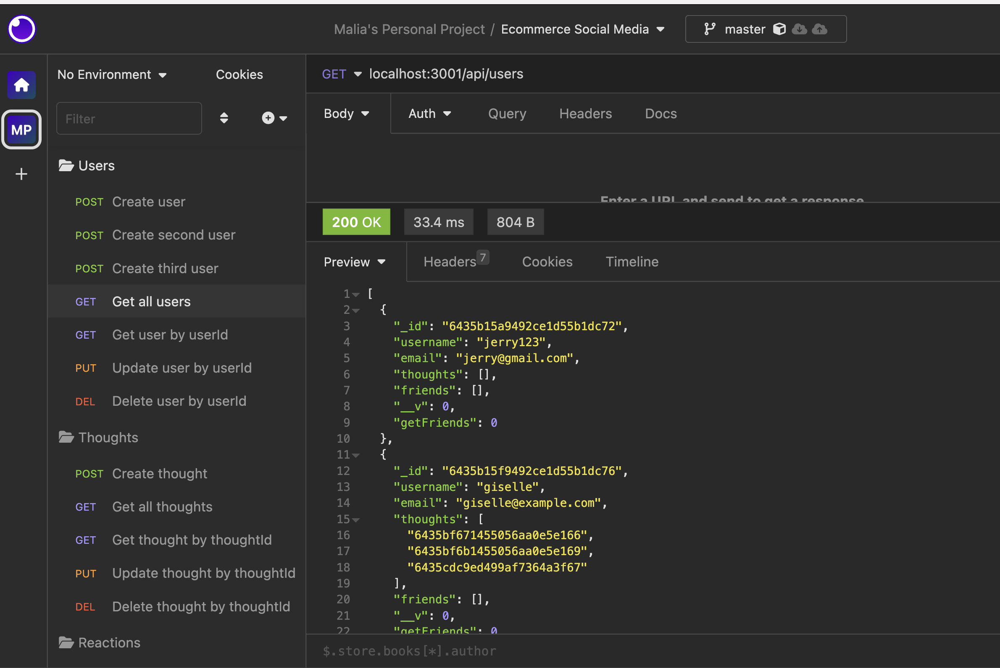
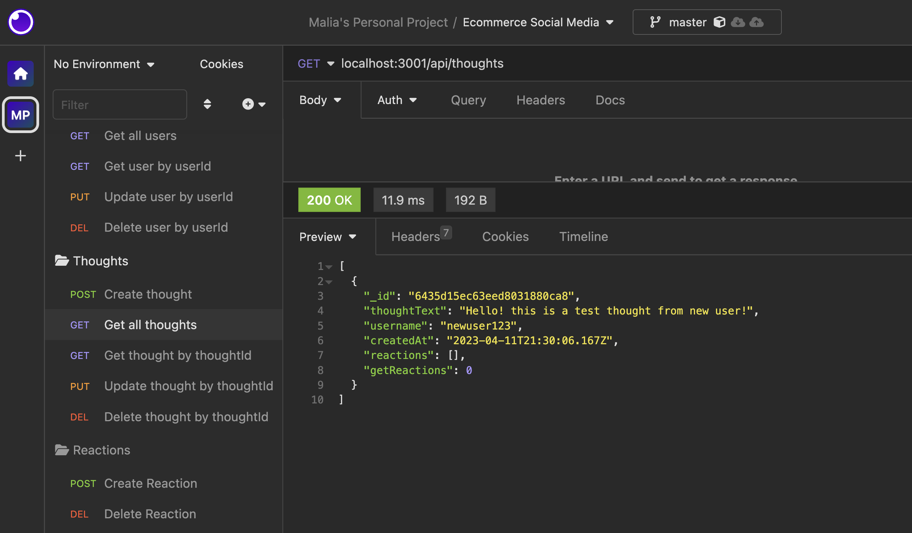

 

# Social Media Backend with MongoDB
 

## Description
Backend for a social media application built with non-relational database MongoDB and Mongoose. 
Check out [this video](https://drive.google.com/file/d/1CziEYfLjBGzFmcj11REfz3ZyZQWaqZgo/view) for a route testing demo with Insomnia.
 

## Table of Contents
* [Installation](#installation)
* [Usage](#usage)
* [Contributing](#contributing)
* [Tests](#tests)
* [Questions](#questions)
 

## Installation
To install necessary dependencies, run the following command:
`npm i`
 

## Usage
`npm run seed` to seed database.
 
`npm run start` to launch application.
 
Open Insomnia to test routes.
 
For a demonstration of route testing, please view the following video [linked here](https://drive.google.com/file/d/1CziEYfLjBGzFmcj11REfz3ZyZQWaqZgo/view).  

 

 

## License
This is a project under the MIT license.
 

## Contributing
N/A
 

## Tests
To run tests, run the following commands

 

## Questions
If you have any questions about the repo or project, please contact me directly at maliayraguen@gmail.com.